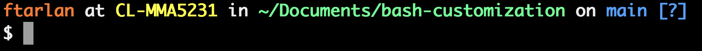

# Bash Customizations
This repo contains a few terminal customizations I like. These customization are heavily inspired by [Corey Schafer's videos](https://www.youtube.com/channel/UCCezIgC97PvUuR4_gbFUs5g) and are grouped into several files.

Clone as many of these files as you like into your home directory and you are good to go! The picture below is an example of the customized prompt. With these changes, you get a two-line bash prompt containing:
- Your username in orange
- Your host name in yellow
- Current working directory in green
- Optionally your git branch, if applicable, in blue
- And whether uncommited/unstanged changes exist in your git working tree, if applicable, in square brackets. 

You also get autocompletion for many common cli commands and command arguments.